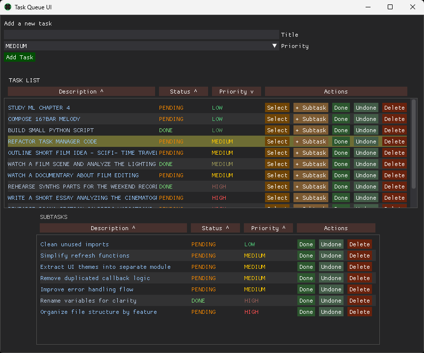

# task_queue — A Task Manager Evolving from CLI to GUI

task_queue began as a clean, test‑driven command‑line task manager focused on clarity, predictable workflows, and maintainable architecture.
The project has since expanded with a DearPyGUI‑based graphical interface, bringing a more intuitive and interactive way to manage tasks while preserving the original design principles.

---

## 🚧 Project Status

The project is actively evolving.
The core logic and test suite remain stable, and the new GUI now supports a complete workflow:

- creating tasks

- editing priorities

- selecting tasks with visual feedback

- managing subtasks

- performing quick actions

- confirming deletions safely

- The interface will continue to improve, but it is already fully functional.

### Current UI Preview 

Here is a preview of the current interface (work in progress): 

---

## GUI Features

### Selectable Task List

- Each task can be selected via a dedicated button

- The selected row is visually highlighted

- Subtasks for the active task appear in a bottom panel

### Editable Priorities

- Priority can be changed through a popup menu (LOW / MEDIUM / HIGH)

- Colors update dynamically based on priority and completion state

- Completed tasks use a distinct color scheme

### Subtasks Panel

- A bottom window displays subtasks for the selected task

- Updates automatically when switching tasks

- Add new subtasks with the + Subtask button

### Quick Actions

- Select

- + Subtask

- Done / Undone

- Delete (with confirmation dialog)

### Delete Confirmation Message Box

- Prevents accidental deletions

- Simple and clear modal dialog

---

## Core Features (Inherited from the CLI Version)

### Task Management

- Priorities: HIGH, MEDIUM, LOW

- Automatic timestamps and unique IDs

- State transitions: PENDING → PROCESSING → COMPLETED / CANCELLED

### Queue Behavior

- Priority‑based selection

- FIFO ordering within the same priority

- Deterministic get_next_task() logic

### Persistence

- JSON‑based storage

- Full round‑trip serialization

- Stable enum handling

---

## Tests

The project includes a complete test suite covering:

- task lifecycle

- priority ordering

- queue behavior

- persistence

- CLI logic

All tests currently pass.

---

## License

This project is licensed under the **MIT License**.

See the `LICENSE` file for full details.

---

## Usage

python -m task_queue.cli <command> [options]

### Examples

python -m task_queue.cli add "Comprar pan" --priority low
python -m task_queue.cli list
python -m task_queue.cli next
python -m task_queue.cli complete <task_id>
python -m task_queue.cli cancel <task_id>
python -m task_queue.cli purge

---

## Project Structure

task_queue/
│
├── cli.py               # CLI entrypoint
├── manager.py           # QueueManager logic
├── task.py              # Task model + enums
├── storage.py           # JSON persistence
│
└── tests/               # Full test suite

---

## Roadmap

- Additional UI refinements

- Sorting and filtering options

- Inline editing for task descriptions

- Optional integration with CLI commands

- Export features

- Light/Dark theme toggle

---

## Final Note

This repository is intentionally public even while evolving.
The goal is to document the process, not just the result — including architecture decisions, refactors, and the test‑driven workflow behind the scenes.